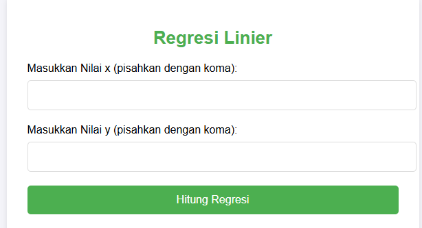

# 🚀 Regresi Linier Web App  
**Aplikasi web untuk menghitung regresi linier dengan visualisasi interaktif.**  
Aplikasi ini dibangun menggunakan Python, Flask, dan MySQL untuk mempermudah analisis data regresi linier melalui antarmuka web yang ramah pengguna.

---

## 📝 Fitur  
- **Input Data:** Masukkan nilai `x` dan `y` dengan format yang mudah (dipisahkan koma).  
- **Perhitungan Regresi Linier:**  
  - Menampilkan garis regresi dalam format \( y = b_0 + b_1x \).  
  - Menghitung koefisien determinasi (R²).  
- **Visualisasi Data:**  
  - Menampilkan grafik regresi linier (scatter plot dengan garis regresi).  
- **Antarmuka Modern:** Desain responsif dan estetis menggunakan HTML & CSS.

---

## 📂 Struktur Proyek  
```
📦 Regresi-Linier-Web-App
 ┣ 📂 project
 ┃ ┗ 📂 static           # Folder untuk menyimpan grafik hasil regresi
 ┣ 📂 templates          # Folder untuk file HTML
 ┃ ┗ 📜 index.html       # Antarmuka web utama
 ┣ 📜 app.py             # File Python utama
 ┣ 📜 requirements.txt   # Daftar dependensi Python
```

---

## 🛠️ Instalasi  
### 1. Clone Repository  
```bash
git clone https://github.com/K3M3K/Regresi-Linier.git
cd Regresi-Linier
cd Pyhton
```

### 2. Buat Virtual Environment  
```bash
python -m venv venv
source venv/bin/activate  # Untuk Linux/Mac
venv\Scripts\activate     # Untuk Windows
```

### 3. Instal Dependensi  
```bash
pip install -r requirements.txt
```

### 4. Konfigurasi Database  
- Pastikan Anda memiliki MySQL dan XAMPP terinstal.  
- Buat database bernama **`metnum`** di MySQL.  
- Sesuaikan username, password, dan nama database di kode Python jika diperlukan:
  ```python
  db = mysql.connector.connect(
      host="localhost",
      user="root",
      password="",
      database="metnum"
  )
  ```

### 5. Jalankan Aplikasi  
```bash
python main.py
```

Akses aplikasi di browser: [http://localhost:5000](http://localhost:5000)

---

## 📦 Dependensi  
Daftar pustaka yang digunakan:
- **Flask**: Framework web Python.  
- **MySQL Connector**: Menghubungkan aplikasi dengan database MySQL.  
- **NumPy**: Perhitungan numerik untuk regresi linier.  
- **Matplotlib**: Membuat visualisasi hasil regresi.

Instal semua pustaka menggunakan file `requirements.txt`:
```bash
pip install -r requirements.txt
```

Isi file `requirements.txt`:
```
Flask==2.3.3
mysql-connector-python==8.0.32
numpy==1.25.1
matplotlib==3.8.1
```

---

## 📊 Demo  
### **Masukkan Data**  
  

### **Hasil Regresi Linier**  
  

---

## 🧑‍💻 Kontribusi  
Kami menyambut kontribusi dari komunitas. Jika Anda memiliki ide baru atau menemukan bug, silakan buat **Pull Request** atau ajukan **Issue**.

---

## 📄 Lisensi  
Proyek ini dilisensikan di bawah [MIT License](LICENSE).  
code by : Maulana Sidik - UHAMKA
--- 

**Happy Coding! 😊**
