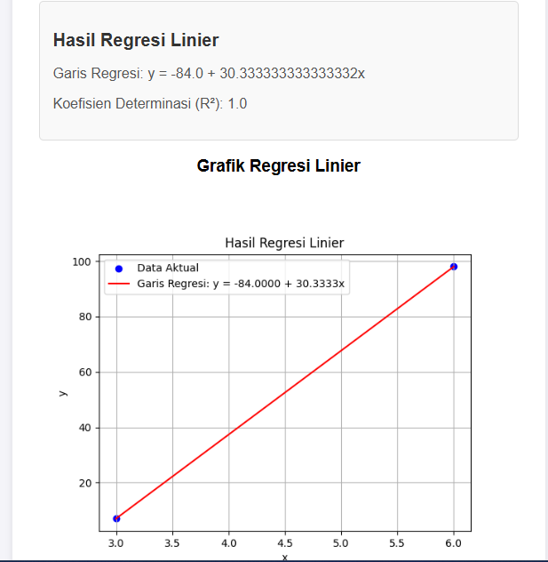

# Aplikasi Web Regresi Linier

Aplikasi ini adalah web sederhana untuk melakukan analisis regresi linier. Pengguna dapat memasukkan nilai `x` dan `y`, dan aplikasi akan menghitung garis regresi linier serta menampilkan koefisien determinasi (R²). Selain itu, grafik regresi linier juga ditampilkan untuk memvisualisasikan data.

---

## Fitur Utama

1. Input nilai `x` dan `y` yang dipisahkan dengan koma.
2. Perhitungan garis regresi linier.
3. Penentuan koefisien determinasi (R²).
4. Visualisasi grafik regresi linier.

---

## Demo Aplikasi

### Form Input
Pada bagian ini, pengguna diminta untuk memasukkan nilai `x` dan `y` yang dipisahkan dengan koma. Contoh tampilan form:


### Hasil Perhitungan
Setelah menghitung regresi linier, aplikasi akan menampilkan hasil garis regresi, nilai koefisien determinasi, dan grafik visualisasi. Berikut adalah contohnya:

**Hasil Regresi Linier:**
- Garis Regresi: `y = -84.0 + 30.333333333333332x`
- Koefisien Determinasi (R²): `1.0`

**Visualisasi Grafik:**


---

## Teknologi yang Digunakan

- **Frontend**: HTML, CSS, JavaScript.
- **Backend**: Python (Flask).
- **Library**: Matplotlib untuk grafik, NumPy untuk perhitungan.

---

## Cara Menjalankan Aplikasi

1. Clone repository ini:
   ```bash
   git clone https://github.com/username/repository-name.git
   ```
2. Masuk ke direktori proyek:
   ```bash
   cd repository-name
   ```
3. Install dependencies menggunakan pip:
   ```bash
   pip install -r requirements.txt
   ```
4. Jalankan server Flask:
   ```bash
   python app.py
   ```
5. Buka browser dan akses aplikasi di `http://127.0.0.1:5000`.

---

## Struktur Proyek

```
📦repository-name
 ┣ 📂static
 ┃ ┣ 📂css
 ┃ ┗ 📂js
 ┣ 📂templates
 ┃ ┗ index.html
 ┣ 📂assets
 ┃ ┣ input_demo.png
 ┃ ┗ output_demo.png
 ┣ app.py
 ┣ requirements.txt
 ┗ README.md
```

---

## Kontribusi

Jika Anda ingin berkontribusi pada proyek ini, silakan fork repository ini dan buat pull request. Setiap masukan dan kontribusi sangat dihargai!

---

## Lisensi

Proyek ini dilisensikan di bawah [MIT License](LICENSE).
